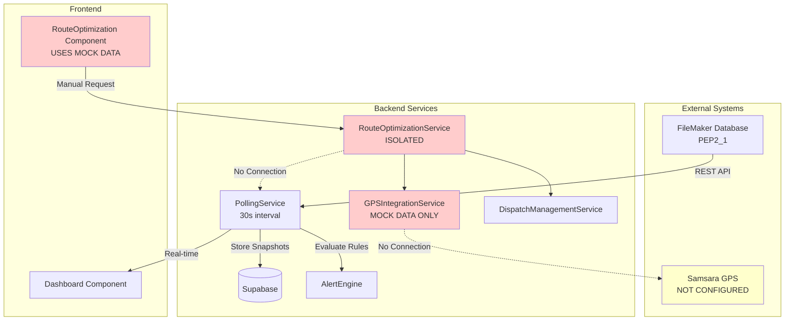
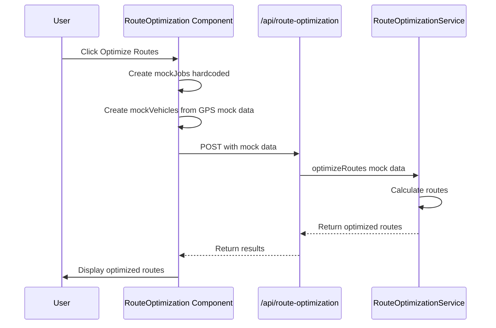
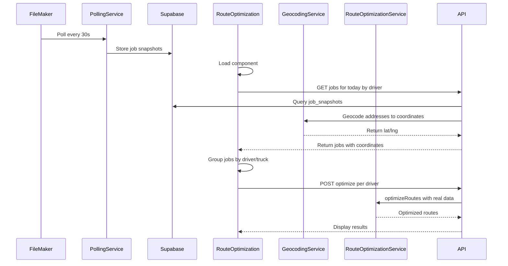

# Route Optimization System - Technical Analysis & Implementation Plan

## Executive Summary

**Status**: Route optimization feature is **FUNCTIONAL but ISOLATED** - it works correctly but uses mock data instead of connecting to live FileMaker jobs.

**Root Cause**: The system was built with a demonstration layer using mock data, awaiting integration with real data sources.

**Impact**: Scheduled jobs requiring route optimization cannot appear on dashboard because the route optimization component doesn't fetch FileMaker data.

---

## 1. Application Architecture

### Current Data Flow



### What's Working ✅
- **PollingService**: Polling FileMaker every 30s (Poll #1407+ active)
- **Data Retrieval**: Successfully fetching 98 jobs per poll
- **Supabase Storage**: Storing 95 job snapshots per poll
- **Alert System**: Generating and displaying alerts correctly
- **Dashboard**: Real-time alerts tab fully functional

### What's NOT Working ❌
- **Route Optimization Integration**: Not connected to FileMaker data
- **GPS Integration**: Using mock vehicle data (3 sample trucks)
- **Automatic Triggers**: No automatic optimization when jobs scheduled
- **Address Geocoding**: No conversion of addresses to coordinates
- **Samsara Integration**: API not configured

---

## 2. Data Synchronization Analysis

### FileMaker Polling Configuration

**Location**: [`src/lib/pollingServiceInstance.js:34`](src/lib/pollingServiceInstance.js:34)

```javascript
interval: parseInt(process.env.POLLING_INTERVAL) || 30000  // 30 seconds
```

**Environment Variables** ([`.env.local`](.env.local:8-13)):
```bash
POLLING_INTERVAL=30000        # 30 seconds
POLLING_BATCH_SIZE=100        # Jobs per poll
POLLING_ENABLED=true          # Always on
POLLING_AUTO_START=true       # Starts automatically
```

**Current Performance** (from terminal logs):
- ✅ **Status**: Active (Poll #1407 running)
- ✅ **Frequency**: Every 30 seconds consistently
- ✅ **Success Rate**: 100% (using fallback query)
- ✅ **Jobs Retrieved**: 98 active jobs per poll
- ✅ **Supabase Storage**: 95 snapshots stored per poll
- ⚠️ **Date Filter Error**: Primary query fails (500 error), uses fallback

**Data Source**: [`FileMakerAPI.getActiveJobs()`](src/api/filemaker.js:108-165)
- **Primary Query**: Date range filter (fails with 500 error)
- **Fallback Query**: All records, client-side filtering
- **Date Range**: Last 30 days by default
- **Sorting**: By `job_date` descending (newest first)

### Samsara/GPS Configuration

**Status**: ❌ **NOT CONFIGURED**

From [`.env.local:28-29`](.env.local:28-29):
```bash
# Optional: Samsara API (for future integration)
# SAMSARA_API_KEY=your_samsara_api_key_here
# SAMSARA_API_URL=https://api.samsara.com
```

**Current GPS Data Source**: Mock vehicles only ([`GPSIntegrationService.js:50-105`](src/services/GPSIntegrationService.js:50-105))
- 3 sample trucks (TRUCK_001, TRUCK_002, TRUCK_003)
- Hardcoded Denver-area coordinates
- Random traffic conditions

---

## 3. FileMaker Data Structure Analysis

### Available Fields (from Excel export)

#### Core Job Fields:
```javascript
{
  _kp_job_id: "909564",           // Job ID
  job_date: "2025-11-10",         // Job date
  job_status: "Scheduled",        // Status: Completed, Scheduled, Canceled, etc.
  job_type: "Move-PU",            // Type: Delivery, Pickup, Move, etc.
  _kf_trucks_id: "R",             // Truck ID
  _kf_lead_id: "Harold Dulaney",  // Driver name
  people_required: "2",           // Crew size
  _kf_product_weight_id: "2660",  // Weight
  oneway_miles: "15.3",           // Distance
  
  // Location fields
  address_C1: "10200 SE SUNNYSIDE RD",
  zip_C1: "97015",
  _kf_city_id: "CLACKAMAS",
  _kf_state_id: "OR",
  
  // Location references
  location_load: "",              // Origin warehouse (e.g., "PEPo", "PEPc")
  location_return: "PEPo",        // Return warehouse
  
  // Timing
  notes_call_ahead: "30 Min Prior",
  time_arival: "1899-12-30",      // Often placeholder date
  time_complete: "1899-12-30"
}
```

#### Job Patterns Observed:
1. **Multi-stop routes**: Drivers have 5-15 jobs per day
2. **Geographic clustering**: Jobs grouped by driver territory (CO, WA, OR, etc.)
3. **Truck assignment**: 81% have truck IDs
4. **Driver assignment**: 83% have driver/lead names
5. **Address data**: 100% have addresses (but NO coordinates)

### Jobs Requiring Route Optimization:

**Criteria** (based on data analysis):
```javascript
job_status IN ['Scheduled', 'Re-scheduled', 'Entered'] 
AND job_date >= TODAY
AND _kf_trucks_id IS NOT NULL
```

**Example from export**:
```
Job 909564: Scheduled, 2025-11-10, Truck R, Harold Dulaney
Job 909566: Scheduled, 2025-11-10, Truck R, Harold Dulaney
Job 909569: Scheduled, 2025-11-10, Truck R, Harold Dulaney
```
These 3 jobs should be optimized together for driver Harold Dulaney.

---

## 4. Route Optimization Technical Flow

### CURRENT (Mock Data) Flow:



### REQUIRED (Real Data) Flow:



---

## 5. Key Technical Gaps & Solutions

### Gap 1: No Address Geocoding ⚠️

**Problem**: FileMaker has addresses but route optimization needs lat/lng coordinates

**Available Data**:
```javascript
address_C1: "10200 SE SUNNYSIDE RD"
zip_C1: "97015"
_kf_city_id: "CLACKAMAS"
_kf_state_id: "OR"
```

**Solution Options**:

**Option A: Google Maps Geocoding API** (Recommended)
- Cost: $5 per 1,000 requests (first $200/month free)
- Accuracy: Highest
- Implementation: Simple REST API
- Cache results in Supabase to minimize costs

**Option B: OpenStreetMap Nominatim** (Free)
- Cost: Free
- Accuracy: Good
- Rate limit: 1 request/second
- Implementation: Slightly slower

**Option C: Pre-geocode in Database**
- Add lat/lng fields to FileMaker
- Geocode once, store forever
- Requires FileMaker schema modification

**Recommendation**: Option A with aggressive caching

### Gap 2: Mock Vehicle Data 

**Current**: 3 hardcoded trucks in Denver area

**FileMaker Reality**: 20+ trucks across multiple states:
- Truck 12 (Oregon)
- Truck 203 (Tennessee)
- Truck 67 (Washington)
- Truck 703 (Georgia)
- etc.

**Solution Options**:

**Option A: Use FileMaker Truck IDs** (Quick fix)
- Extract unique `_kf_trucks_id` from jobs
- Create vehicle objects from truck assignments
- Use job locations as "last known position"
- **Pro**: Works immediately without GPS
- **Con**: Not real-time tracking

**Option B: Integrate Samsara GPS** (Full solution)
- Configure Samsara API credentials
- Map FileMaker truck IDs to Samsara vehicle IDs
- Get real-time GPS positions
- **Pro**: Real tracking data
- **Con**: Requires Samsara account setup

**Recommendation**: Start with Option A, upgrade to Option B when ready

### Gap 3: No Job-to-Route Connection

**Problem**: PollingService retrieves jobs but doesn't trigger route optimization

**Current Architecture**:
```javascript
// PollingService - Standalone
jobs = FileMaker.getActiveJobs() 
→ Store in Supabase
→ Evaluate Alerts
→ END (no route optimization)

// RouteOptimization - Standalone  
Click button → Use mock data → Optimize → Display
```

**Required Architecture**:
```javascript
// Integrated Flow
jobs = FileMaker.getActiveJobs()
→ Store in Supabase
→ Evaluate Alerts
→ Filter scheduled jobs
→ Group by driver/truck
→ Trigger route optimization
→ Store optimized routes
→ Display on dashboard
```

---

## 6. Implementation Plan - Updated

### Phase 1: Connect Real Job Data (Quick Win - 2-4 hours)

**Goal**: Display real FileMaker jobs with optimized routes (without GPS)

**Tasks**:
1. Create geocoding service using Google Maps API
2. Create API endpoint `/api/jobs/by-driver?date=YYYY-MM-DD`
3. Modify RouteOptimization.jsx to fetch real jobs
4. Extract truck data from job assignments
5. Geocode addresses on-demand with caching
6. Display actual optimized routes for real drivers

**Result**: See today's scheduled jobs optimized by driver

### Phase 2: Add Real-time GPS (Optional - 4-8 hours)

**Requirements**:
- Samsara API credentials
- Truck ID mapping (FileMaker ID → Samsara vehicle ID)

**Tasks**:
1. Configure Samsara API in `.env.local`
2. Create Samsara integration service
3. Map FileMaker `_kf_trucks_id` to Samsara vehicle IDs
4. Replace mock GPS data with real positions
5. Update vehicle tracking in real-time

### Phase 3: Automation & Feedback (Future - 1-2 days)

**Tasks**:
1. Auto-trigger optimization for newly scheduled jobs
2. Write optimized routes back to FileMaker
3. Add route change notifications
4. Implement real-time route adjustments

---

## 7. Specific Questions Based on Data Analysis

Now that I've reviewed your actual job data, I need to clarify: